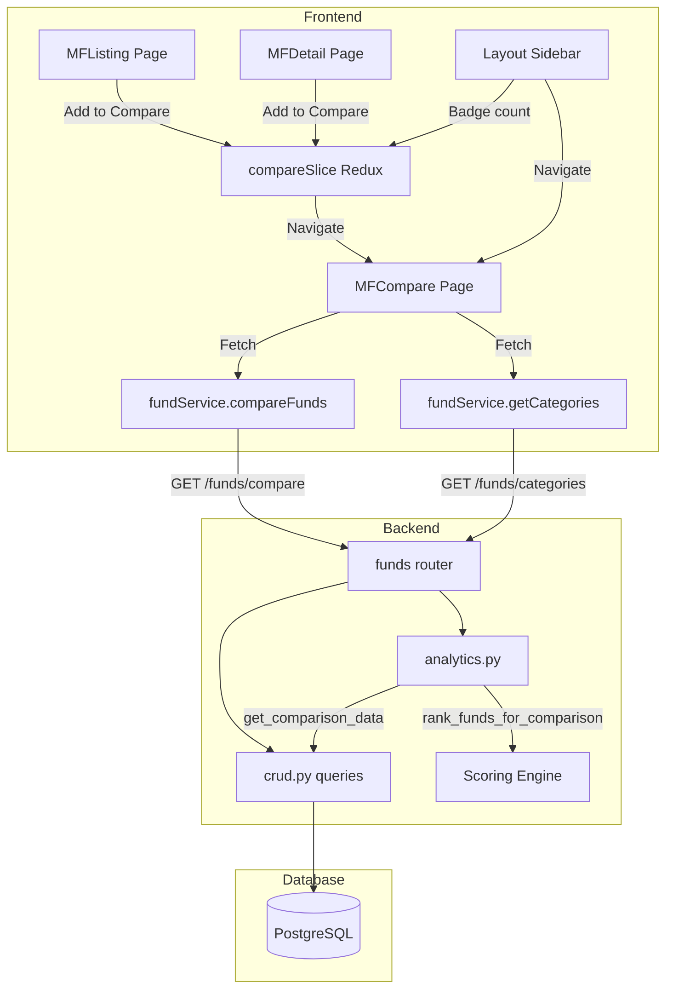

# Mutual Fund Comparison Feature — Implementation Plan

## Goal

Build a full-featured **Compare Mutual Funds** experience that lets users select up to 4 funds of the **same category**, view their metrics side-by-side in a tabular layout, and receive an **AI-scored recommendation** for the best fund among the selection.

---

## Current State Summary

| Aspect | What Exists Today |
|---|---|
| **Backend API** | `GET /funds/compare?codes=...` — validates same-category, fetches pre-computed `FundMetrics` for each fund, returns `{ funds: [...], warning? }` |
| **Backend Scoring** | `analytics.py` has `final_verdict` per fund (Sharpe + Alpha thresholds) but **no cross-fund ranking / recommendation** |
| **Frontend Page** | `MFCompare.jsx` — basic table with 5 hardcoded rows (category, 1Y return, sharpe, exit_load, AMC). Reads from `compareSlice` Redux state |
| **Redux State** | `compareSlice.js` — maintains `compareList[]` with add/remove/clear. Enforces max 4 + same category+subcategory |
| **Sidebar** | `Layout.jsx` → `SideNavBar` — 5 items (Home, Stocks, MF, Portfolio, Admin). **No Compare entry** |
| **Route** | `/compare` route exists in `App.jsx`, renders `<MFCompare />` |
| **Fund Selector** | No dedicated fund picker for comparison. Users must add funds from MFListing, but MFListing has **no "Add to Compare" button** |

---

## Proposed Changes

Changes are grouped by component and ordered dependencies-first.

---

### Component 1 — Backend: Category Listing Endpoint

> Enables the frontend to show a category dropdown filtered dynamically.

#### [NEW] `GET /api/v1/funds/categories`

**File:** [funds.py](file:///home/prasad/dev_home/mutual_fund_exp/stock_nivesh_platform/backend/app/routers/funds.py)

Add a new endpoint **above** the `/{scheme_code}` route (to avoid path collision):

```python
@router.get("/categories", response_model=List[str])
async def list_categories(session: AsyncSession = Depends(get_db)):
    """Return distinct scheme_category values from active funds."""
    ...
```

**File:** [crud.py](file:///home/prasad/dev_home/mutual_fund_exp/stock_nivesh_platform/backend/app/crud.py)

Add:
```python
async def get_distinct_categories(session: AsyncSession) -> List[str]:
    q = select(FundMaster.scheme_category).where(FundMaster.is_active == True).distinct()
    res = await session.execute(q)
    return sorted([row[0] for row in res.all()])
```

---

### Component 2 — Backend: Comparison Recommendation Engine

> Core scoring algorithm that ranks the compared funds and suggests a winner.

#### [MODIFY] [analytics.py](file:///home/prasad/dev_home/mutual_fund_exp/stock_nivesh_platform/backend/app/analytics.py)

Add a new function `rank_funds_for_comparison(funds_metrics: List[dict]) -> dict` that:

1. **Normalises** each metric to a 0–100 scale using **min-max normalisation** across the compared set.
2. **Applies directional polarity** — higher-is-better vs lower-is-better metrics.
3. **Computes a weighted composite score** per fund.
4. **Returns** a ranked list with scores and the recommended fund.

##### Metric Groups & Weights

| Group | Weight | Metrics (direction) |
|---|---|---|
| **Returns** | 35% | `cagr_3year` (↑), `cagr_5year` (↑), `absolute_return_1y` (↑), `absolute_return_3y` (↑), `short_term_return_6m` (↑) |
| **Risk-Adjusted** | 30% | `sharpe_ratio` (↑), `sortino_ratio` (↑), `information_ratio` (↑), `alpha` (↑) |
| **Risk** | 20% | `standard_deviation` (↓), `maximum_drawdown` (↓ — less negative = better), `beta` (↓ closer to 1 is neutral, but lower = less market risk), `downside_capture` (↓) |
| **Cost & Size** | 10% | `expense_ratio` (↓), `aum_in_crores` (↑) |
| **Consistency** | 5% | `upside_capture` (↑), `data_completeness_percentage` (↑) |

##### Algorithm Pseudocode

```
for each metric in all_metrics:
    values = [fund.metrics[metric] for fund in funds]  # skip None
    if all None → skip metric
    min_val, max_val = min(values), max(values)
    for each fund:
        if fund.value is None → normalized = 0
        elif max_val == min_val → normalized = 50  # tie
        else:
            if higher_is_better:
                normalized = (val - min_val) / (max_val - min_val) * 100
            else:
                normalized = (max_val - val) / (max_val - min_val) * 100
    
    fund.group_score += normalized * (metric_weight_within_group)

for each fund:
    composite_score = sum(group.score * group.weight for group in groups)

recommended_fund = fund with max composite_score
```

##### Return Schema

```python
{
    "rankings": [
        {
            "scheme_code": "119598",
            "rank": 1,
            "composite_score": 78.5,
            "group_scores": {
                "returns": 85.2,
                "risk_adjusted": 72.1,
                "risk": 80.0,
                "cost_and_size": 65.3,
                "consistency": 90.0
            },
            "is_recommended": true,
            "recommendation_reason": "Highest composite score driven by strong risk-adjusted returns (Sharpe 1.82) and low expense ratio (0.31%)."
        },
        ...
    ],
    "comparison_summary": "Fund X leads by 12.3 points primarily due to superior 3Y CAGR and Sharpe ratio."
}
```

---

#### [MODIFY] [funds.py](file:///home/prasad/dev_home/mutual_fund_exp/stock_nivesh_platform/backend/app/routers/funds.py)

Enhance the existing `GET /funds/compare` endpoint to include the ranking output:

```python
@router.get("/compare", response_model=schemas.ComparisonResponse)
async def compare_funds(...):
    # ... existing validation (same category, max 4, fetch masters)
    comparison_data = await analytics.get_comparison_data(session, scheme_codes)
    
    # NEW: Compute recommendation
    all_metrics = [f["metrics"] for f in comparison_data["funds"]]
    ranking = analytics.rank_funds_for_comparison(all_metrics, scheme_codes)
    comparison_data["ranking"] = ranking
    
    return comparison_data
```

#### [MODIFY] [schemas.py](file:///home/prasad/dev_home/mutual_fund_exp/stock_nivesh_platform/backend/app/schemas.py)

Extend `ComparisonResponse`:

```python
class FundRanking(BaseModel):
    scheme_code: str
    rank: int
    composite_score: float
    group_scores: Dict[str, float]
    is_recommended: bool
    recommendation_reason: Optional[str] = None

class RankingResult(BaseModel):
    rankings: List[FundRanking]
    comparison_summary: str

class ComparisonResponse(BaseModel):
    funds: List[Dict[str, Any]]
    ranking: Optional[RankingResult] = None
    warning: Optional[str] = None
```

---

### Component 3 — Frontend: API Service & Redux Updates

#### [MODIFY] [fundService.js](file:///home/prasad/dev_home/mutual_fund_exp/stock_nivesh_platform/frontend/src/api/services/fundService.js)

Add:
```javascript
getCategories: async () => {
    const response = await apiClient.get('/funds/categories');
    return response.data;
},
```

#### [MODIFY] [compareSlice.js](file:///home/prasad/dev_home/mutual_fund_exp/stock_nivesh_platform/frontend/src/store/slices/compareSlice.js)

Major overhaul:

1. **Add async thunks:**
   - `fetchComparisonData` — calls `fundService.compareFunds(codes)` and stores the full response (metrics + ranking).
   - `fetchCategories` — calls `fundService.getCategories()`.
   - `fetchFundsByCategory` — calls `fundService.getFunds(...)` filtered by selected category, for the fund picker.

2. **New state shape:**
   ```javascript
   {
       compareList: [],                // Selected funds (max 4)
       selectedCategory: null,         // Category lock
       comparisonResult: null,         // Full API response { funds, ranking, warning }
       categories: [],                 // All available categories
       categoryFunds: [],              // Funds in the selected category (for picker)
       categoryFundsLoading: false,
       comparisonLoading: false,
       comparisonError: null,
   }
   ```

3. **Update `addToCompare` reducer:**
   - If `compareList` is empty, auto-set `selectedCategory` from the added fund's `scheme_category`.
   - On `clearCompare`, also reset `selectedCategory`.
   - Relax the subcategory enforcement (only enforce main `scheme_category` match — subcategory mismatch is a warning, not a block). This aligns with the backend behaviour.

---

### Component 4 — Frontend: Sidebar Navigation

#### [MODIFY] [Layout.jsx](file:///home/prasad/dev_home/mutual_fund_exp/stock_nivesh_platform/frontend/src/components/Layout.jsx)

Add a **"Compare Funds"** entry to the `SideNavBar` `navItems` array:

```javascript
const navItems = [
    { name: 'Homepage', icon: 'home', path: '/dashboard' },
    { name: 'Stocks Listing', icon: 'monitoring', path: '/stocks' },
    { name: 'Mutual Funds', icon: 'account_balance', path: '/mf' },
    { name: 'Compare Funds', icon: 'compare_arrows', path: '/compare' },  // NEW
    { name: 'Portfolio Page', icon: 'account_balance_wallet', path: '/portfolio' },
    { name: 'Admin Panel', icon: 'admin_panel_settings', path: '/admin' },
];
```

Additionally, add a **compare badge** that shows the count of funds in the compare list (read from Redux `state.compare.compareList.length`). This requires:
- Importing `useSelector` in `Layout.jsx`.
- Rendering a small pill badge next to the "Compare Funds" nav item when count > 0.

---

### Component 5 — Frontend: "Add to Compare" Button on MFListing

#### [MODIFY] [MFListing.jsx](file:///home/prasad/dev_home/mutual_fund_exp/stock_nivesh_platform/frontend/src/pages/MFListing.jsx)

Add an **"Add to Compare"** button to each fund card (grid view) and each table row (table view):

- Import `addToCompare`, `removeFromCompare` from `compareSlice`.
- Import `useSelector` to read `compareList`.
- For each fund, show a toggle button:
  - If fund is in `compareList` → show "Remove" (red).
  - If fund is not in list and list < 4 and category matches (or list is empty) → show "Add" (gold).
  - If fund category doesn't match the locked category → show disabled "Different Category" tooltip.
  - If list is at max 4 → show disabled "Max 4 reached".

Also add a **floating compare dock/bar** at the bottom of the page that shows selected funds and a "Compare Now" button linking to `/compare`.

---

### Component 6 — Frontend: Redesigned MFCompare Page

#### [MODIFY] [MFCompare.jsx](file:///home/prasad/dev_home/mutual_fund_exp/stock_nivesh_platform/frontend/src/pages/MFCompare.jsx)

**Complete rewrite** of this page. The new page has three major sections:

##### Section A — Fund Selector (if < 2 funds selected)

A full-screen fund picker flow:

1. **Category Picker** — Dropdown/pills showing all categories fetched from `GET /funds/categories`. Selecting a category filters the fund list.
2. **Fund Search/List** — Scrollable list of funds in the selected category, with search. Each fund has an "Add" button gated by the same-category rule.
3. **Selected Funds Preview** — Shows 1–4 card slots at the top, with "X" to remove.
4. **"Compare" Button** — Enabled when ≥ 2 funds selected. Triggers `fetchComparisonData`.

##### Section B — Comparison Table (when data is loaded)

A **comprehensive tabular comparison** with funds as columns and metrics as rows. Structured in collapsible groups:

| Group | Rows |
|---|---|
| **Fund Info** | Scheme Name, AMC, Category, Subcategory, Inception Date, ISIN |
| **Valuation** | Current NAV, AUM (Cr), Expense Ratio, Fund Rating |
| **Returns** | 6M Return, 1Y Return, 3Y Return, 5Y Return, 10Y Return, 3Y CAGR, 5Y CAGR |
| **Risk-Adjusted Performance** | Sharpe Ratio, Sortino Ratio, Alpha, Beta, Information Ratio |
| **Risk Metrics** | Std Deviation, Max Drawdown, Tracking Error, Volatility |
| **Capture Ratios** | Upside Capture, Downside Capture |
| **Data Quality** | Data Completeness %, Calculation Period, Sufficient Data |
| **Verdict** | Final Verdict (per fund) |

**Visual enhancements:**
- **Best-in-row highlighting:** For each metric row, highlight the cell with the best value in green/gold.
- **Worst-in-row:** Highlight the worst value in a subtle red/dim.
- **Sticky first column** — the metric label column stays fixed on horizontal scroll.
- **Responsive:** Horizontal scroll on mobile.

##### Section C — Recommendation Panel

Below the table, a prominent **"Our Recommendation"** card:

- Shows the **#1 ranked fund** with its composite score.
- Radar/spider chart (using Recharts) showing group scores for all compared funds overlaid.
- **Ranking breakdown** — ordered list of all funds with their scores and rank badges.
- **Recommendation reason** text from the backend.

---

### Component 7 — Frontend: "Add to Compare" on MFDetail Page

#### [MODIFY] [MFDetail.jsx](file:///home/prasad/dev_home/mutual_fund_exp/stock_nivesh_platform/frontend/src/pages/MFDetail.jsx)

Add an **"Add to Compare"** button in the hero header section, next to the existing "Refresh Artifact" button area:

- Same toggle logic as MFListing.
- Shows a toast/snackbar confirming addition.
- If the fund's category doesn't match the currently locked category, show an alert explaining the constraint.

---

## Architecture Diagram



---

## Task Breakdown

### Backend Tasks

| # | Task | Files | Estimate |
|---|---|---|---|
| B1 | Add `get_distinct_categories()` to crud.py | [crud.py](file:///home/prasad/dev_home/mutual_fund_exp/stock_nivesh_platform/backend/app/crud.py) | 15 min |
| B2 | Add `GET /funds/categories` endpoint | [funds.py](file:///home/prasad/dev_home/mutual_fund_exp/stock_nivesh_platform/backend/app/routers/funds.py) | 15 min |
| B3 | Implement `rank_funds_for_comparison()` scoring engine | [analytics.py](file:///home/prasad/dev_home/mutual_fund_exp/stock_nivesh_platform/backend/app/analytics.py) | 1.5 hrs |
| B4 | Add `FundRanking`, `RankingResult` schemas; extend `ComparisonResponse` | [schemas.py](file:///home/prasad/dev_home/mutual_fund_exp/stock_nivesh_platform/backend/app/schemas.py) | 20 min |
| B5 | Integrate ranking into `GET /funds/compare` endpoint | [funds.py](file:///home/prasad/dev_home/mutual_fund_exp/stock_nivesh_platform/backend/app/routers/funds.py) | 30 min |
| B6 | Write unit tests for `rank_funds_for_comparison` | [NEW] `backend/tests/test_ranking.py` | 1 hr |

### Frontend Tasks

| # | Task | Files | Estimate |
|---|---|---|---|
| F1 | Add `getCategories()` to fundService | [fundService.js](file:///home/prasad/dev_home/mutual_fund_exp/stock_nivesh_platform/frontend/src/api/services/fundService.js) | 10 min |
| F2 | Overhaul `compareSlice` — new state shape, async thunks | [compareSlice.js](file:///home/prasad/dev_home/mutual_fund_exp/stock_nivesh_platform/frontend/src/store/slices/compareSlice.js) | 1 hr |
| F3 | Add "Compare Funds" to sidebar with badge | [Layout.jsx](file:///home/prasad/dev_home/mutual_fund_exp/stock_nivesh_platform/frontend/src/components/Layout.jsx) | 30 min |
| F4 | Add "Add to Compare" button + floating dock to MFListing | [MFListing.jsx](file:///home/prasad/dev_home/mutual_fund_exp/stock_nivesh_platform/frontend/src/pages/MFListing.jsx) | 1.5 hrs |
| F5 | Add "Add to Compare" button on MFDetail | [MFDetail.jsx](file:///home/prasad/dev_home/mutual_fund_exp/stock_nivesh_platform/frontend/src/pages/MFDetail.jsx) | 30 min |
| F6 | Full rewrite of MFCompare — Fund Picker UI | [MFCompare.jsx](file:///home/prasad/dev_home/mutual_fund_exp/stock_nivesh_platform/frontend/src/pages/MFCompare.jsx) | 2 hrs |
| F7 | Full rewrite of MFCompare — Comparison Table | [MFCompare.jsx](file:///home/prasad/dev_home/mutual_fund_exp/stock_nivesh_platform/frontend/src/pages/MFCompare.jsx) | 2.5 hrs |
| F8 | Full rewrite of MFCompare — Recommendation Panel + Radar Chart | [MFCompare.jsx](file:///home/prasad/dev_home/mutual_fund_exp/stock_nivesh_platform/frontend/src/pages/MFCompare.jsx) | 1.5 hrs |

### Suggested Implementation Order

```
B1 → B2 → B3 → B4 → B5 → B6 (backend complete)
F1 → F2 → F3 → F4 → F5 (infrastructure + entry points)
F6 → F7 → F8 (compare page — can start after B5)
```

---

## Open Questions

> [!IMPORTANT]
> **Q1: Subcategory enforcement** — The current `compareSlice` blocks adding funds with different subcategories. The backend only enforces same **category** (subcategory mismatch is a warning). Should the frontend also relax to match the backend (allow subcategory mismatch with a warning banner)?

> [!IMPORTANT]
> **Q2: Scoring weights** — The proposed weights are (Returns 35%, Risk-Adjusted 30%, Risk 20%, Cost 10%, Consistency 5%). Do you want to adjust these or make them user-configurable via sliders on the UI?

> [!NOTE]
> **Q3: Floating compare dock** — Should the "compare dock" (bottom bar showing selected funds) appear globally across all pages, or only on MFListing and MFDetail? A global dock would require moving it into `Layout.jsx`.

> [!NOTE]
> **Q4: Component extraction** — The MFCompare page is quite large. Should it be split into separate component files (e.g., `components/Compare/FundPicker.jsx`, `components/Compare/ComparisonTable.jsx`, `components/Compare/RecommendationPanel.jsx`)?

---

## Verification Plan

### Automated Tests

```bash
# Backend unit tests for the scoring algorithm
cd backend && python -m pytest tests/test_ranking.py -v

# Existing endpoint tests should still pass
python -m pytest test_api_simple.py -v
```

### Manual / Browser Tests

1. **Category endpoint** — `curl http://localhost:8000/api/v1/funds/categories` returns distinct categories.
2. **Compare endpoint** — `curl "http://localhost:8000/api/v1/funds/compare?codes=119598,120503"` returns `funds` array + `ranking` object.
3. **Category enforcement** — Attempting to compare funds of different categories returns HTTP 400.
4. **Sidebar** — "Compare Funds" link visible, badge updates when funds are added.
5. **MFListing** — "Add to Compare" button visible, category mismatch handled gracefully.
6. **MFCompare** — Full flow: pick category → add funds → table renders all metrics → recommendation shows.
7. **Edge cases** — Compare with 2 funds (min), compare with 4 funds (max), funds with no metrics (empty dict).
