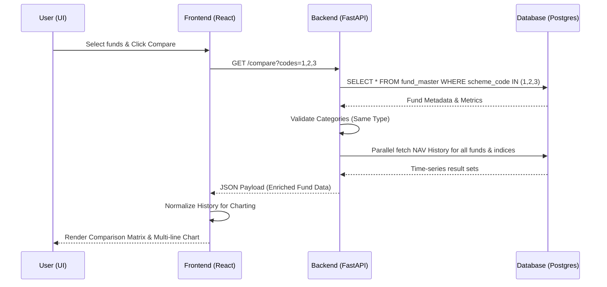

# Feature: Mutual Fund Comparison (End-to-End Design)

## 1. Overview
The Mutual Fund Comparison feature allows users to perform a detailed head-to-head analysis of multiple mutual funds (up to 4) of the same category. This helps users make informed investment decisions based on performance and risk metrics.

## 2. Requirements & Constraints
- **Maximum Funds**: 4 assets can be compared side-by-side.
- **Domain Constraint**: Comparison is restricted to funds within the same `scheme_category` to ensure "apples-to-apples" analysis.
- **Metrics Focused**: Comparison is based on rolling returns, risk ratios (Sharpe, Sortino, Alpha, Beta), and AUM.
- **Dynamic UI**: Responsive layout that adjusts from 2-way to 4-way comparison.

## 3. Technology Stack
- **Backend**: FastAPI (Python 3), SQLAlchemy (ORM), Pydantic (Validation & Schemas).
- **Frontend**: React.js, Recharts (Visualization), Axios (API Client), Tailwind CSS (Styling).
- **Communication**: REST API (JSON).

## 4. Backend Architecture

### 4.1 Resource Endpoint
**`GET /api/v1/funds/compare?codes=1,2,3`**

- **Purpose**: Fetch multi-dimensional data for 2-4 mutual funds for side-by-side comparison.
- **Authorization**: Required (Bearer JWT).

### 4.2 Data Flow & Validation
1. **Input Parsing**: Splits the `codes` string and handles whitespace.
2. **Structural Validation**: Rejects if `< 2` or `> 4` funds are requested.
3. **Identity Verification**: Fetches `FundMaster` for each code; returns `404` if any asset is not found.
4. **Category Enforcement**: Compares `scheme_category` across all fetched funds; rejects if they differ.
5. **Data Enrichment**: 
   - **Metrics**: Loads pre-calculated risk/return ratios from `FundMetrics`.
   - **Trajectories**: Fetches last 500 history points for funds (`FundNavHistory`) and their benchmarks (`BenchmarkNavHistory`).
   - Uses `asyncio.gather` for parallel database queries across all selected assets.

## 5. Frontend Architecture

### 5.1 Selection & State Management
- **Selection Mechanism**: Users can select funds from listing pages or detail pages via "Add to Compare" toggles.
- **Client-Side Pre-validation**: Warns the user immediately if they attempt to pick a fund from a different category.
- **Routing**: Navigation to `/compare?codes=1,2,3` triggers the fetch.

### 5.2 Visualization Engine
- **Comparison Table**: A grid-based layout showing AMC, Category, Returns (3Y/5Y), Ratios (Sharpe, etc.), and AUM.
- **Highlighting Logic**: Automatically applies success/error styles to "Winning" metrics in each row.
- **Unified Charting**: A Recharts `LineChart` showing NAV trajectories for all funds and their benchmarks (dashed lines).

## 6. Sequence Diagram

## 7. Performance & Optimization
- **Eager Loading**: Uses `joinedload` for metrics to avoid N+1 query issues.
- **Payload Trimming**: Fetches max 500 points per fund history to ensure snappy browser performance.
- **Parallelism**: Fully leverages Python's `asyncio` for non-blocking I/O.
