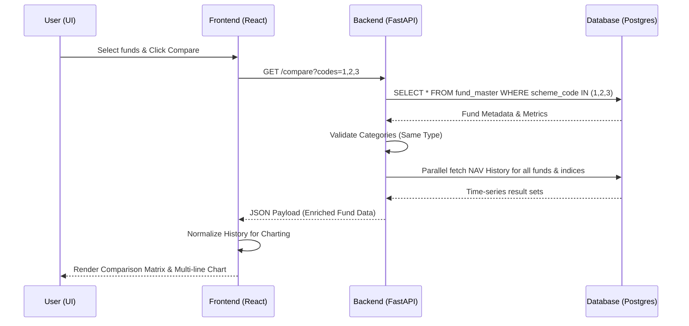

# Low Level Design: Mutual Fund Comparison (End-to-End)

## 1. Introduction
This document outlines the end-to-end design for the Mutual Fund Comparison feature in the Nivesh Elite platform. It covers the architectural components from the database layer to the frontend user interface.

## 2. Technology Stack
- **Backend**: FastAPI (Python 3), SQLAlchemy (ORM), Pydantic (Validation & Schemas).
- **Frontend**: React.js, Recharts (Visualization), Axios (API Client), Tailwind CSS (Styling).
- **Communication**: REST API (JSON).

## 3. Backend Architecture

### 3.1 Resource Endpoint
**`GET /api/v1/funds/compare`**

- **Purpose**: Fetch multi-dimensional data for 2-4 mutual funds for side-by-side comparison.
- **Query Params**: `codes` (comma-separated string of `scheme_code`).
- **Authorization**: Required (Bearer JWT).

### 3.2 Routing & Logic (`backend/app/routers/funds.py`)
1. **Input Parsing**: Splits the `codes` string and handles whitespace.
2. **Structural Validation**:
   - Rejects if `< 2` or `> 4` funds are requested.
   - Throws `400 Bad Request` for invalid fund counts.
3. **Identity Verification**:
   - Fetches `FundMaster` for each code via `crud.get_fund_master_by_code`.
   - Returns `404 Not Found` if any asset identity is unverified.
4. **Domain Constraint**:
   - Compares `scheme_category` across all fetched funds.
   - Enforces "Same Type" rule: Rejects with `400 Bad Request` if categories differ.
5. **Data Enrichment**:
   - **Metrics**: Loads pre-calculated risk/return ratios from `FundMetrics`.
   - **Trajectories**: Fetches last 500 history points for funds (`FundNavHistory`) and their respective benchmarks (`BenchmarkNavHistory`).
   - Uses `asyncio.gather` for non-blocking concurrent I/O.

### 3.3 Data Models
- **FundMaster**: Core asset metadata (Name, Category, AMC, Benchmark Code).
- **FundMetrics**: Computed performance tokens (3Y/5Y Returns, Sharpe, Sortino, Alpha, Beta, AUM).
- **FundNavHistory**: Time-series NAV values.

## 4. Frontend Architecture

### 4.1 API Integration (`frontend/src/api/services/fundService.js`)
- `compareFunds(codes)`: Maps an array of scheme codes to the backend query string format.

### 4.2 Selection Mechanism (`frontend/src/pages/MFListing.jsx`)
- **Selection Dock**: A global state or component-level state tracking selected funds.
- **Interactive Toggles**: "Add to Compare" / "Remove" actions on fund cards and table rows.
- **Client-Side Pre-validation**:
  - Warns the user immediately if they attempt to pick a fund from a different category.
  - Limits selection to 4 active assets.

### 4.3 Comparison Engine (`frontend/src/pages/MFCompare.jsx`)
- **Data Normalization**: Merges disparate time-series histories into a unified `chartData` array indexed by date for Recharts.
- **Metric Comparison Grid**:
  - Dynamically renders columns based on the number of funds (2, 3, or 4).
  - Highlighting logic: Compares values across the row and applies success/error styles to the "Winning" metric.
- **Dynamic Layout**: 
  - 2 Funds: Wide comparison.
  - 3-4 Funds: Compact grid layout to maintain readability on different viewports.

## 5. Sequence Diagram (Data Flow)

## 6. Error & Edge Case Handling
- **Missing Metrics**: Display `--` for stale or uncalculated metrics without breaking the UI.
- **Benchmark Mismatch**: If funds have different benchmarks, show both benchmark lines in the chart with distinct dashed styles.
- **Empty States**: If no codes are provided in the URL, redirect or show a "No Selection" placeholder.
- **Connectivity**: Global error toast if the backend synchronization protocol fails.

## 7. Performance Optimizations
- **Eager Loading**: `joinedload(FundMaster.metrics)` to avoid N+1 queries.
- **Point Capping**: Fetching max 500 NAV points per fund to keep payload size manageable for browsers.
- **Concurrency**: Python `asyncio` for all DB interactions.
