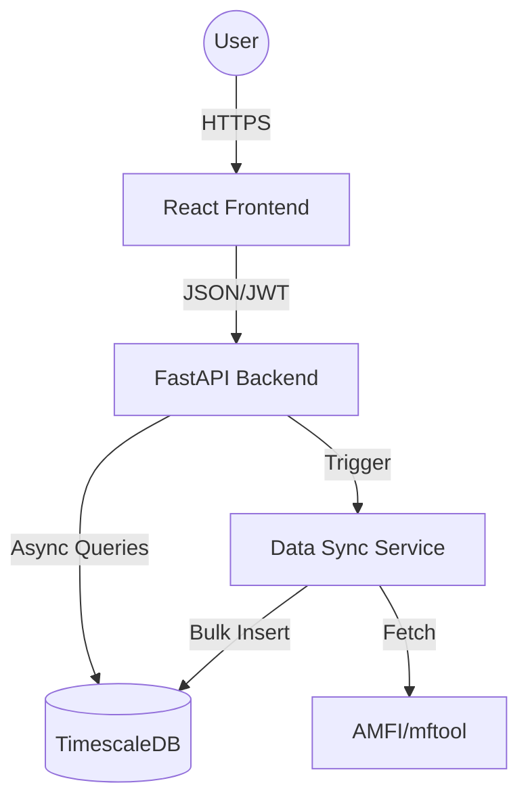

# Nivesh Elite Platform: Technical Overview

Nivesh Elite is a professional-grade financial analytics and portfolio management platform designed for high-performance and aesthetic excellence.

## 🏗️ System Architecture

The project follows a modern microservices-inspired architecture with a clear separation between the presentation layer and the analytical backend.

### Core Components
- **Frontend**: A sleek, dark-mode React application optimized for financial data visualization.
- **Backend**: A high-performance asynchronous API built for complex risk calculations and time-series data management.
- **Database**: PostgreSQL with the TimescaleDB extension, enabling efficient handling of millions of historical data points.

---

## 🛠️ Tech Stack

| Layer | Technology |
| :--- | :--- |
| **Frontend** | React, Vite, Vanilla CSS (Califino Style) |
| **Backend** | FastAPI, SQLAlchemy (Async), Uvicorn |
| **Database** | PostgreSQL + TimescaleDB |
| **Data Engine** | Pandas, mftool |
| **Infrastructure** | Docker, Docker Compose |

---

## 🔐 Security Model
- **JWT Authentication**: Secure stateless authentication for administrative tools.
- **Role-Based Access**: Public read access to metrics with write/sync restrictions for authenticated users.
- **Data Integrity**: Enforced via unique constraints and TimescaleDB segmentations.
