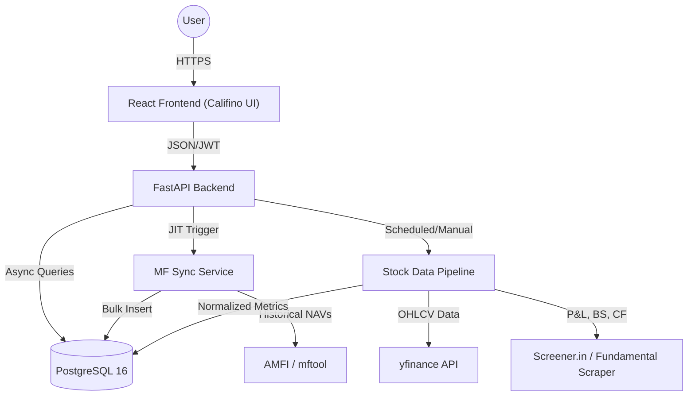

# Nivesh Elite Platform: Technical Overview

Nivesh Elite is a professional-grade financial analytics and portfolio management platform designed for high-performance and aesthetic excellence.

## 🏗️ System Architecture

The project follows a modern microservices-inspired architecture with a clear separation between the presentation layer and the analytical backend, now featuring a dual-engine for Mutual Funds and Equities.

### Core Components
- **Frontend**: A sleek, dark-mode React application powered by the **Califino** design system—a premium, glassmorphic UI optimized for financial data visualization.
- **Backend**: A high-performance asynchronous API built with FastAPI, handling complex risk calculations (Sharpe, Sortino) and a robust ratio engine for equities.
- **Data Pipelines**:
    - **MF Engine**: Just-In-Time (JIT) synchronization with AMFI.
    - **Stock Engine**: Multi-stage pipeline for OHLCV ingestion, fundamental scraping, and YoY ratio computation.
- **Database**: PostgreSQL 16, utilizing GIN trigram indexes for full-text search and LATERAL JOINs for high-performance analytics.

---

## 🛠️ Unified Tech Stack

| Layer | Technology | Details |
| :--- | :--- | :--- |
| **Frontend** | React 19, Vite 8 | Custom Hash-based Routing, Redux Toolkit (4 slices) |
| **Styling** | Vanilla CSS | **Califino Design System** (Glassmorphism, CSS Variables) |
| **Backend** | FastAPI | Asynchronous Pydantic v2, JWT Authentication |
| **Analytics** | Pandas, NumPy | Vectorized performance for 17+ financial ratios |
| **Database** | PostgreSQL 16 | Relational master data + time-series price data |
| **Data Sources** | mftool, yfinance | AMFI (India Mutual Funds) and NSE/BSE Equities |
| **Testing** | pytest + pytest-asyncio | 45+ tests, in-memory SQLite, all endpoints covered |
| **Infrastructure** | Docker | Docker Compose for DB and PGAdmin |

---

## 🔐 Security & Access Control
- **Stateless Auth**: JWT (JSON Web Tokens) for administrative and sync operations.
- **Audit Trails**: Pipeline audit tables tracking every scrape and computation job.
- **Data Integrity**: Enforced via composite keys and MD5-based deduplication in ingest pipelines.
