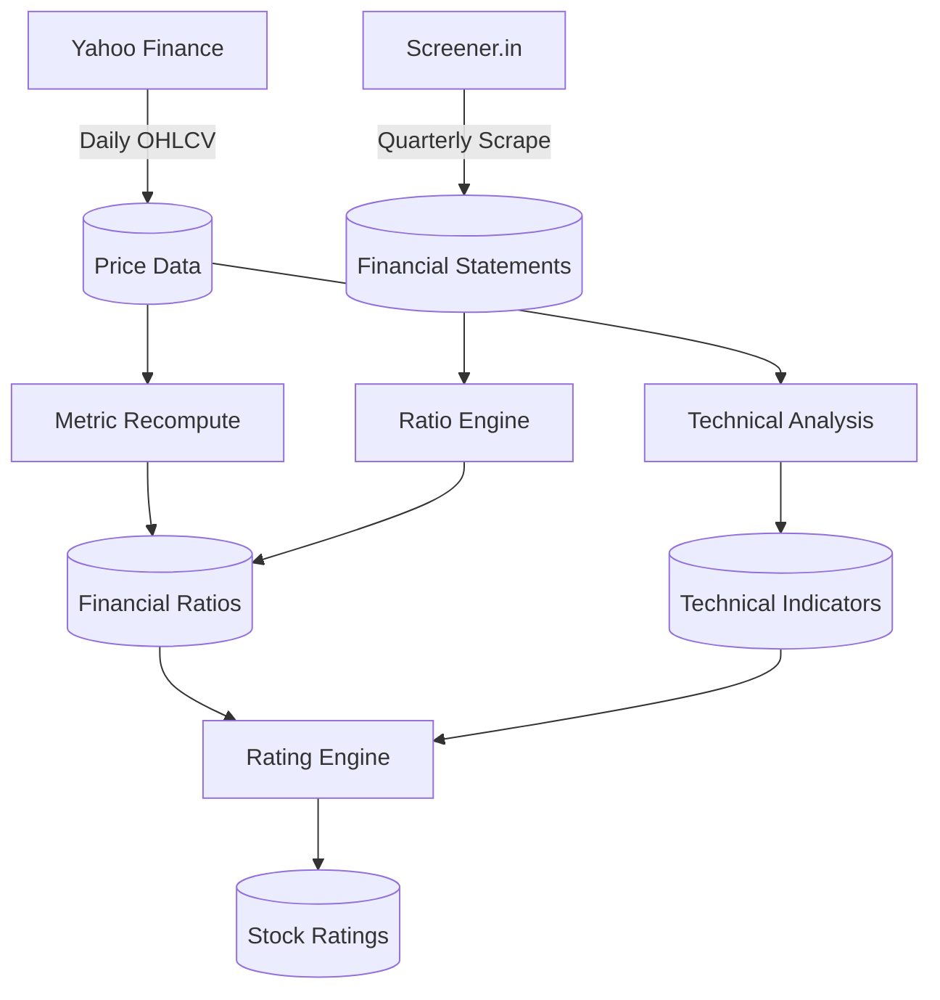

# Stock Nivesh Platform — Data Pipeline Architecture

Welcome to the data pipeline layer of the Stock Nivesh Platform! If you are a Data Engineer or Backend Developer looking to understand how market data, fundamentals, and technical indicators flow into the system, this is your starting point.

## 1. High-Level Architecture

Our platform runs a robust, asynchronous data pipeline that continuously hydrates our database with fresh information. The pipeline has five core stages, orchestrated primarily by `APScheduler` but fully decoupled and manually triggerable via robust API endpoints.



### Module Breakdown (Inside `backend/pipeline/`)

| Module | Purpose | Cadence |
|---|---|---|
| `price_ingestion.py` | Fetches daily prices and volume from Yahoo Finance using `yfinance`. | Mon–Fri (18:30 IST) |
| `metric_recompute.py` | Recomputes price-dependent ratios (PE, PB, PS) based on the latest close price without touching quarterly data. | Mon–Fri (19:00 IST) |
| `technical_analysis.py` | Computes Technical Indicators (SMA, EMA, RSI, MACD, etc.) using `ta-lib` (C-bindings) for extreme performance. | Mon–Fri (19:30 IST) |
| `fundamental_scraper.py` | Scrapes latest Pl, BS, and Cash Flow from Screener.in for stocks with stale (>90 days) data. | Weekly (Sun 02:00 IST) |
| `ratio_engine.py` | Computes quarterly financial ratios (ROE, Margins, D/E) after a successful fundamental scrape. | Weekly (Sun 09:00 IST) |
| `rating_engine.py` | Generates a 5-dimension composite stock rating score (Fundamental, Valuation, Technical, Momentum, Shareholding) via min-max normalization. | Mon–Fri (20:15 IST) |
| `scheduler.py` | Binds all these automated runs together using `APScheduler`. | N/A |
| `audit.py` | Centralized `pipeline_audit` logging for performance and failure tracking. | N/A |

---

## 2. Triggering the Pipeline Manually

As a developer, you won't want to wait for the scheduler. Every stage of the pipeline is exposed gracefully as a secure admin API endpoint in `app/routers/pipeline.py`.

> **Note:** All endpoints are authenticated. Make sure you provide a valid Bearer JWT.

### A. Prices and Indicators (Daily Data)

```bash
# 1. Fetch latest prices for all active stocks (Background Task)
curl -X POST http://localhost:8000/api/v1/pipeline/prices/all -H "Authorization: Bearer <TOKEN>"

# 2. Recompute price-dependent ratios (PE, PB)
curl -X POST http://localhost:8000/api/v1/pipeline/metrics/price-refresh/all -H "Authorization: Bearer <TOKEN>"

# 3. Compute Technical Analysis indicators
curl -X POST http://localhost:8000/api/v1/pipeline/technical/all -H "Authorization: Bearer <TOKEN>"
```

### B. Fundamentals (Quarterly Data)

Screener scraping is intentionally slow (to avoid rate limits, with ~2-5s delays between requests).

```bash
# 1. Force scrape a *single* stock (Useful for testing)
# Using ?force=true overrides the checksum check that prevents redundant DB writes.
curl -X POST "http://localhost:8000/api/v1/pipeline/screener/RELIANCE?force=true" -H "Authorization: Bearer <TOKEN>"

# 2. Recompute the core financial ratios 
curl -X POST http://localhost:8000/api/v1/pipeline/ratios/RELIANCE -H "Authorization: Bearer <TOKEN>"
```

### C. The Composite Rating Engine

```bash
# 1. Re-evaluate overall stock scores based on all updated data layers
curl -X POST http://localhost:8000/api/v1/pipeline/ratings/all -H "Authorization: Bearer <TOKEN>"
```

---

## 3. Key Technical Decisions & Best Practices

If you are modifying the pipeline codebase, keep these constraints in mind:

1. **ta-lib over pandas-ta:** We selected `ta-lib` (compiled C-bindings) for indicator generation. Pure python variants are too slow on thousands of stocks over a 5-year OHLCV window.
2. **Database Connection Pooling:** **Do not use `asyncpg.connect()` loosely.** Always use the `raw_connection()` context manager imported from `app.database`. This guarantees your script relies on the FastAPI asynchronous connection pool, heavily mitigating "Too Many Clients" PostgreSQL errors during bulk operations.
3. **Pipeline Audit Logging:** Before doing structural changes, wrap your main handler in `async with audit_job("job_name") as audit:`. This ensures transparent fail-state observability directly in the `pipeline_audit` table.
4. **Idempotency constraints:** Use `ON CONFLICT DO UPDATE` whenever ingesting. Jobs can be re-run manually multiple times without database pollution.

---

## 4. Future Enhancements & Roadmap

While the pipeline is deeply robust, here are areas the data team is planning for future evolutionary phases:

* **Pattern Detection Engine Layer:** We have a reserved model `DetectedPattern`. The future state requires integrating machine learning or heuristic rules (like Double Tops, Head & Shoulders, Support/Resistance zones) into the daily run.
* **Corporate Actions Sync:** Integrating a scraper or webhook to automatically capture Stock Splits and Bonuses. This limits the reliance on Yahoo Finance for auto-adjustment accuracy.
* **Intraday Support:** Moving `yfinance` to a tighter interval (15m or 1h) instead of `1d` for a subset of hyper-active users or premium tiers. 
* **Worker Queue Pattern (Celery/Redis):** As stock volumes scale, `BackgroundTasks` might starve the FastAPI container. Moving heavy workloads (like Screener.in scraping) to dedicated scalable Celery workers.
